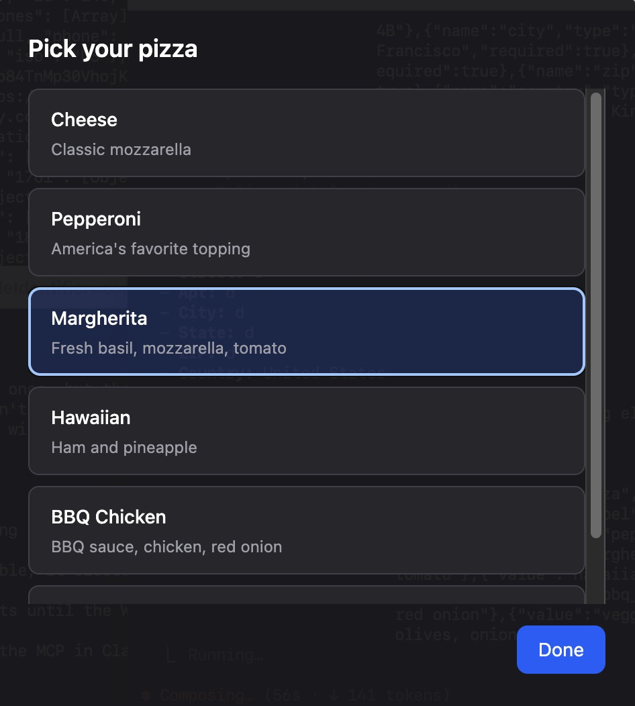
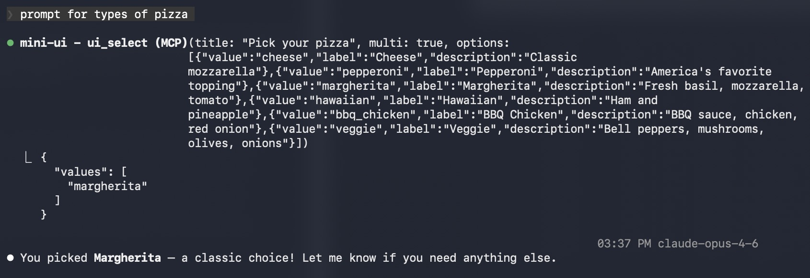

# mini-ui-mcp

A lightweight, chromeless Electron window that AI coding agents can drive via MCP to display rich UI interactions — confirmations, selection lists, forms, and more — without leaving the terminal.

## Screenshots

**The agent calls a tool, the UI pops up:**



**Back in the terminal, the result is returned:**



## Quick Start

```bash
npm install
npm run dev   # starts the Vite dev server (UI on :5173)
```

Then wire it into Claude Code:

```bash
claude mcp add -s user mini-ui -- npx tsx /path/to/mini-ui-mcp/server/index.ts
```

Claude Code will spawn the MCP server automatically. Vite just needs to be running so the Electron window has something to load.

## Architecture

```
Agent ──MCP──► server/index.ts ──WebSocket──► React UI (Electron window)
                                  :9999
```

1. MCP server registers 5 tools and opens a WebSocket on `localhost:9999`
2. Agent calls a tool → server spawns an Electron window → sends a render command over WebSocket
3. React UI renders the component, collects user input, sends the result back
4. Server returns the result as the MCP tool response
5. Window closes after each interaction; reopens for the next one

## MCP Tools

| Tool | Description | Blocking |
|------|-------------|----------|
| `ui_open` | Opens/focuses the window | No |
| `ui_confirm` | Yes/No confirmation dialog | Yes |
| `ui_select` | Single or multi-select list | Yes |
| `ui_form` | Dynamic form with multiple field types | Yes |
| `ui_display` | Show markdown, progress, or diffs | No |

## Scripts

- `npm run dev` — Start the Vite dev server (UI on `:5173`)
- `npm run build` — Build UI and compile server
- `npm start` — Run the built MCP server

## Configuring with Claude Code

```bash
# User-level (available in all Claude Code sessions)
claude mcp add -s user mini-ui -- npx tsx /path/to/mini-ui-mcp/server/index.ts
```

## Configuring with Claude Desktop

Add to your Claude Desktop MCP config:

```json
{
  "mcpServers": {
    "mini-ui": {
      "command": "node",
      "args": ["path/to/mini-ui-mcp/dist/server/index.js"]
    }
  }
}
```
